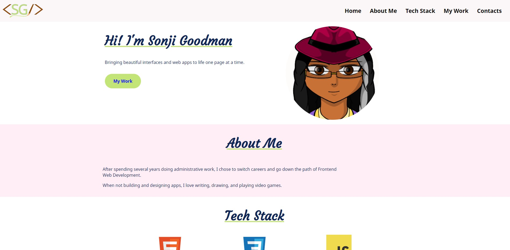
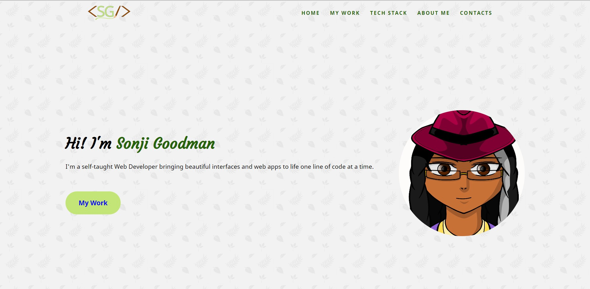

# PORTFOLIO SITE<!-- omit in toc -->

This is my protfolio website to display my work and for people to get in touch with me in the future!

 

## Version 2.0<!-- omit in toc -->

- **UPDATED:** September 6, 2021

 

# CONTENTS
- [CONTENTS](#contents)
  - [Introduction](#introduction)
  - [Screenshots](#screenshots)
    - [Version 1](#version-1)
    - [Version 2](#version-2)
  - [Tools I Used](#tools-i-used)
  - [What I learned](#what-i-learned)
  - [Items for further study](#items-for-further-study)
  - [Helpful resources](#helpful-resources)
    - [MODULES/IMPORT/EXPORT](#modulesimportexport)
  - [About me](#about-me)
 

Introduction
---
I put together my site earlier this year so I could get the word out about my intentions to go down the path of a web designer. While it was cheery and very much me, I felt that I could fancy it up a bit, incorporating some of the skills that I've learnt since then.

 

Screenshots
---

### Version 1

### Version 2

 

Tools I Used
---

* HTML
* CSS
* JavaScript ES6
* Mobile-First Design Method

 

What I learned
---

Instead of getting the information for my projects using async/await, I wanted to try using import/export (just learnt it). It worked out quite lovely, really.

Also, it was fun using smooth scroll. Definitely gonna use it more!

 

Items for further study
---
I would like to practice using Import/Export in ES6. Also, using Smooth Scroll for navigation.

 

Helpful resources
---

- [Build 15 JavaScript Projects - Scroll](https://youtu.be/3PHXvlpOkf4?t=12766): I enjoy doing tutorials from freeCodeCamp, and John Smilga's one of my fave teachers. In this vid he goes over how to use a slick scroll for website navigation

### MODULES/IMPORT/EXPORT
For those interested in learning more about how import/export work in ES6, here are some resources to help:

- [Share App Code with Modules -- Scrimba](https://scrimba.com/learn/javascript/share-app-code-with-modules-cNqb2bTN)
- [import - MDN Web Docs](https://developer.mozilla.org/en-US/docs/Web/JavaScript/Reference/Statements/import)
- [export - MDN Web Docs](https://developer.mozilla.org/en-US/docs/Web/JavaScript/Reference/Statements/export)
- [Modules - JavaScript.info](https://javascript.info/modules)

 

About me
---

Thanks for checking out this project! 😃 You can find my profiles at these sites:

- [Personal Website](www.sonjigoodman.com)
- [Twitter: @IT_Sonji](https://twitter.com/sonji_it)
- [Frontend Mentor - @infinity-Mineeva](https://www.frontendmentor.io/profile/Infinity-Mineeva)